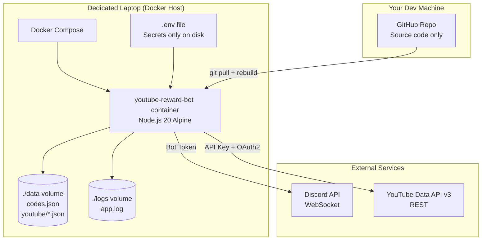
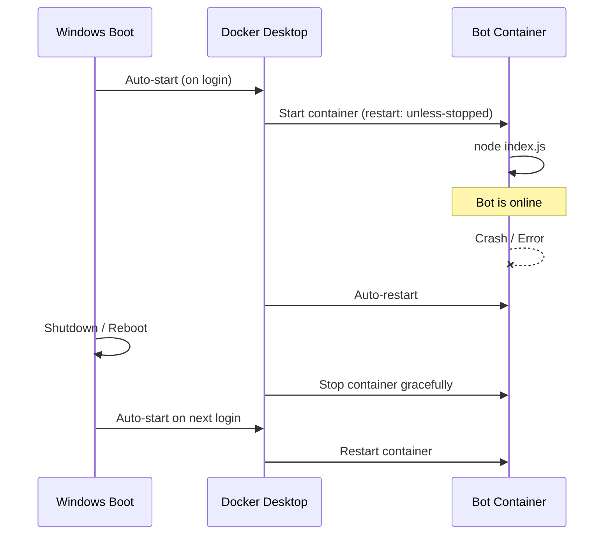
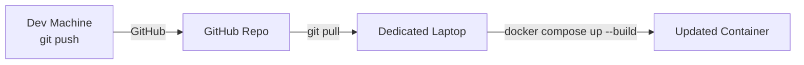

# Docker Deployment Guide — YoutubeRewardBot

A complete guide to deploying the bot on a dedicated always-on laptop using Docker.

---

## Architecture Overview



---

## Feasibility

**High.** The bot is a Node.js process with:
- No exposed ports (connects outbound only)
- No database server dependency
- Minimal resource usage (~50–80 MB RAM)
- File-based storage that maps cleanly to Docker volumes

---

## Challenges & Mitigations

| Challenge | Detail | Mitigation |
|---|---|---|
| **File-based storage** | `data/` and `logs/` are lost on container rebuild by default | Bind-mount as Docker volumes |
| **Secrets management** | `.env` must not be in the image | `env_file` in compose; copy manually to host |
| **Auto-restart on reboot** | Container must survive OS restarts | `restart: unless-stopped` in compose |
| **Laptop sleep** | Bot goes offline if laptop sleeps | Disable sleep in Windows power settings |
| **Clock accuracy** | Code expiry uses timestamps | NTP is on by default — no action needed |
| **File locking in Docker** | `proper-lockfile` uses filesystem locks | Works correctly in single-container setup |
| **Auto-login after power cut** | Docker starts on login — needs login | Configure Windows auto-login (optional) |

---

## Files to Add to the Repository

### `Dockerfile`

```dockerfile
FROM node:20-alpine

WORKDIR /app

# Install dependencies first (cached layer — faster rebuilds)
COPY package*.json ./
RUN npm ci --omit=dev

# Copy source
COPY . .

# data/ and logs/ are mounted as volumes — not baked in
CMD ["node", "index.js"]
```

### `docker-compose.yml`

```yaml
services:
  bot:
    build: .
    container_name: youtube-reward-bot
    restart: unless-stopped
    env_file:
      - .env
    volumes:
      - ./data:/app/data
      - ./logs:/app/logs
```

### `.dockerignore`

```
node_modules
.env
logs
test-*
test-data
```

---

## Data Persistence

```mermaid
graph LR
    subgraph "Host Filesystem"
        HD[./data/codes.json]
        HY[./data/youtube/*.json]
        HL[./logs/app.log]
    end

    subgraph "Container /app"
        CD[/app/data/codes.json]
        CY[/app/data/youtube/*.json]
        CL[/app/logs/app.log]
    end

    HD <-->|volume mount| CD
    HY <-->|volume mount| CY
    HL <-->|volume mount| CL
```

Volumes are bind-mounted from the host. Rebuilding or restarting the container
never erases your data.

---

## Step-by-Step Setup on the New Laptop

### Step 1 — System Prep

1. Ensure Windows 10 or 11 is installed and up to date
2. **Disable sleep:**
   - Settings → System → Power & Sleep
   - Sleep (plugged in): **Never**
3. Connect to your network (wired preferred)

### Step 2 — Install Required Software

| Software | URL | Notes |
|---|---|---|
| Git | https://git-scm.com/download/win | Use defaults |
| Docker Desktop | https://docker.com/products/docker-desktop | Enable "Start on login" during setup |

After Docker Desktop installs:
- Open Docker Desktop → Settings → General → ✅ "Start Docker Desktop when you log in"

### Step 3 — Clone the Repository

Open a terminal and run:

```bash
git clone https://github.com/bot-imlur/youtube-reward-bot.git
cd youtube-reward-bot
```

### Step 4 — Create `.env` on the New Machine

> [!CAUTION]
> Never email or message your `.env`. Transfer via USB drive or a trusted password manager only.

Create a `.env` file in the project root with all values filled in:

```env
BOT_TOKEN=
CLIENT_ID=
GUILD_ID=
YOUTUBE_API_KEY=
ADMIN_USER_ID=
GLOBAL_ALLOWED_CHANNELS=
GTA_VC_ALLOWED_CHANNELS=
YOUTUBE_CLIENT_ID=
YOUTUBE_CLIENT_SECRET=
YOUTUBE_REFRESH_TOKEN=
```

Use `.env.example` in the repo as the reference for all keys.

### Step 5 — Add Docker Files to the Repo (from your dev machine)

Add `Dockerfile`, `docker-compose.yml`, and `.dockerignore` (see above) to the repo,
commit and push from your dev machine. Then on the new laptop:

```bash
git pull
```

### Step 6 — Build and Start the Bot

```bash
docker compose up -d --build
```

- `-d` runs in background (detached)
- `--build` builds the image from source

### Step 7 — Verify

```bash
docker compose logs -f
```

You should see:
```
Logged in as YTClaimRewardBot#0360
```

---

## Container Lifecycle



---

## Day-to-Day Management Commands

```bash
# View live logs
docker compose logs -f

# Check status
docker compose ps

# Restart the bot
docker compose restart

# Stop the bot
docker compose down

# Update after pushing new code changes
git pull
docker compose up -d --build
```

---

## Auto-Login After Power Outage (Optional)

If the power cuts and the laptop reboots, Docker will auto-start on login —
but only if someone logs in. To make this fully automatic:

1. Press `Win + R` → type `netplwiz` → Enter
2. Select your user account
3. Uncheck **"Users must enter a user name and password to use this computer"**
4. Click OK → enter your password to confirm

After this: reboot → Windows logs in automatically → Docker starts → bot comes online.

---

## Discord on the New Machine

> [!NOTE]
> The bot does **not** need the Discord client app to run.
> It connects to Discord's API using only `BOT_TOKEN` — fully headless.

If you also want your personal Discord account on the machine:
- Download from https://discord.com/download
- Log in with your personal account
- Completely independent of the bot — no conflicts

---

## Updating the Bot



```bash
# On the dedicated laptop whenever you push updates:
git pull
docker compose up -d --build
```

The old container is replaced seamlessly. Volume data is preserved.

---

## Resource Requirements

| Resource | Usage |
|---|---|
| RAM | ~50–80 MB |
| CPU | Negligible (event-driven, mostly idle) |
| Disk | ~200 MB (image) + data/logs |
| Network | Outbound only — Discord WebSocket + YouTube API |
| Ports | None exposed |
